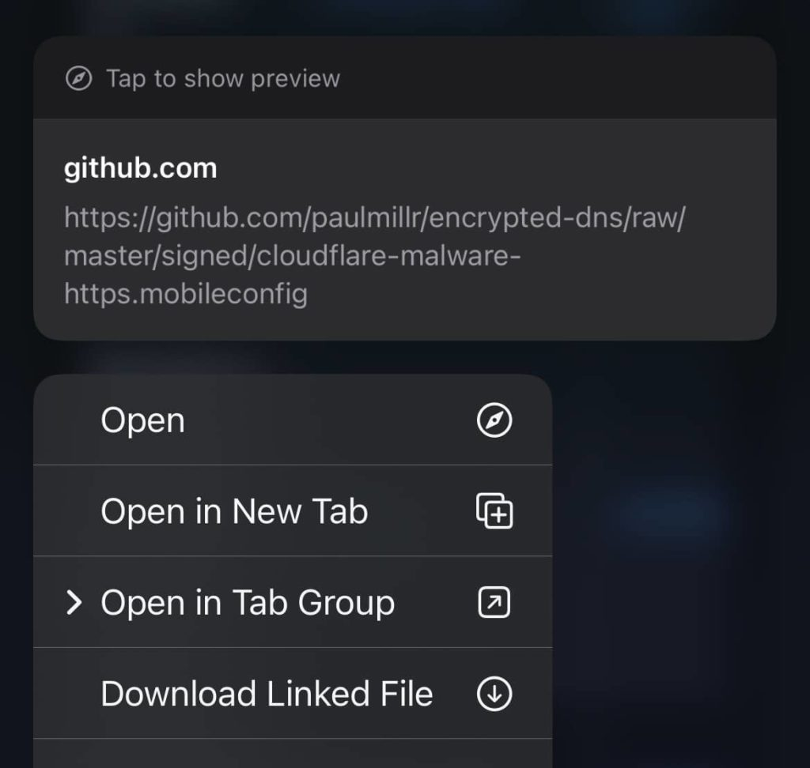
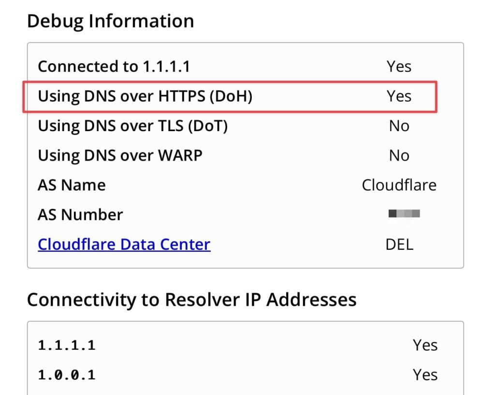

# How to Enable DNS over HTTPS on iOS

Here’s how to quickly enable DNS over HTTPS (DoH) on your iOS (iPhone & iPad) using CloudFlare DNS. This setup encrypts your DNS queries for better privacy.

## Step 1: Download the Encrypted DNS Profile

Decide the DNS resolver you want to go with: I use the CloudFlare Security as it Blocks malware & phishing, and it's very fast for my location. I also use Quad9 for the same.

1.  **Visit the Encrypted DNS GitHub Repository:** Open Safari on your iPhone and go to <a href="https://github.com/paulmillr/encrypted-dns?tab=readme-ov-file#providers" class="ek-link" target="_blank" aria-label=" (opens in a new tab)" rel="noreferrer noopener">github.com/paulmillr/encrypted-dns</a>.
2.  **Download your preferred DoH profile:** (For example, I'm using Cloudflare Malware) Scroll to the **Providers** section and tap on HTTPS ***cloudflare-malware-https.mobileconfig*** in the "Install (Signed - Recommended)" column to download the configuration profile.

Just tap and hold on "HTTPS," click "Download Linked File," and make sure the saved file has the .mobileconfig extension.

<figure class="aligncenter size-large is-resized">

</figure>

### Step 2: Install the Profile

1.  **Open the Settings App:** After downloading, open Settings. You’ll see "Profile Downloaded" at the top.
2.  **Install the Profile:**
    - Tap on the notification or go to **Settings \> General \> Profiles**.
    - Select the *Cloudflare Security DoH* profile.
    - Tap **Install**, enter your passcode if prompted, and confirm the installation.

### Step 3: Verify the DNS Settings

1.  **Check the Profile Installation:**\
    Go to **Settings \> General \> VPN & Device Management** and confirm that the `Quad9 DoH` profile is listed.
2.  **Verify DNS Over HTTPS is Active:**\
    (CloudFlare only) Open Safari and visit <a href="https://one.one.one.one/help/" class="ek-link" aria-label=" (opens in a new tab)" target="_blank" rel="noreferrer noopener">1.1.1.1/help</a>. Scroll to the "Using DNS over HTTPS (DoH)" section to check if it says "Yes."

<figure class="aligncenter size-large is-resized">

</figure>

If it says "Yes", well you’ve now successfully enabled DNS over HTTPS on your iPhone.

Similarly, if you're using Quad9, you can verify its DNS here - <a href="https://on.quad9.net/" class="ek-link" target="_blank" aria-label=" (opens in a new tab)" rel="noreferrer noopener">on.quad9.net</a>

## What is DNS over HTTPS?

DNS over HTTPS (DoH) is like sending secret messages over the internet. Normally, when you type a website name, your computer asks another computer for directions, but it does this out loud, where anyone can listen in. With DoH, these directions are sent in a locked box that only the right computer can open, keeping your online activities private and safe from prying eyes.

In more technical terms, DoH encrypts DNS queries by sending them over the HTTPS protocol, the same secure method used to protect data between your browser and websites.

This encryption prevents your ISP, hackers, or other third parties from intercepting and reading your DNS requests, for both your online privacy and security.
